# Benchmarks

Benchmarks were run on an Apple M3 MacBook Air with 16 GB RAM, macOS 26.3.1, Python 3.13.3. Timing columns are fresh-process cold-start medians, so parser caches do not carry across samples.

## Enron Email Dataset

`100` manually reviewed snippets from the Enron Email Dataset, each resolved against its email's send time. `member acc` is the published Enron metric: matched datetimes over expected datetimes, with list and range members counted individually. The latency column below is same-process median per snippet, not a cold-start figure.


| parser | member acc | median per snippet (ms) |
| --- | ---: | ---: |
| timefhuman | <ins><strong>85/136</strong></ins> | 0.1 |
| parsedatetime.parseDT | 51/136 | 0.3 |
| recurrent.parse | 50/136 | 1.1 |
| ctparse.ctparse | 38/136 | 19.4 |
| dateparser* | 18/136 | 65.3 |
| datefinder.find_dates | 15/136 | <ins><strong><0.1</strong></ins> |

`acc` is the correctness score for the dataset immediately to the left.
- Document `acc` is member-level coverage: lists and ranges still count as correct when a baseline finds the individual members separately.
- Document `group` is grouped correctness: lists and ranges only count when they are returned as one grouped result.
- Document `#` is the number of extracted datetimes for the dataset immediately to the left.
- Most parsers use a 2-second timeout for short and whole-document rows. `dateparser*` uses a 30-second timeout. `timeout` in an `acc` column means the correctness run hit that cap.

These datasets are taken from datefinder's README: https://github.com/akoumjian/datefinder/blob/master/README.rst#benchmark-snapshot

### Main Results

| parser | short (ms) | acc | core (ms) | # | acc | group | sea_76k (ms) | # | acc | group | test_data_560k (ms) | # | acc | group |
| --- | ---: | ---: | ---: | ---: | ---: | ---: | ---: | ---: | ---: | ---: | ---: | ---: | ---: | ---: |
| timefhuman | <ins><strong>2.5</strong></ins> | <ins><strong>28/28</strong></ins> | <ins><strong>2.7</strong></ins> | [13](matches/timefhuman/core_corpus.md) | <ins><strong>14/14</strong></ins> | <ins><strong>13/13</strong></ins> | <ins><strong>23.0</strong></ins> | [56](matches/timefhuman/seattle_html_76k.md) | <ins><strong>57/57</strong></ins> | <ins><strong>56/56</strong></ins> | <ins><strong>168.0</strong></ins> | [557](matches/timefhuman/test_data_560k.md) | <ins><strong>94/94</strong></ins> | <ins><strong>74/74</strong></ins> |
| datefinder.find_dates | *18.8* | 10/28 | *17.6* | [11](matches/datefinder.find_dates/core_corpus.md) | 9/14 | 7/13 | *85.8* | [57](matches/datefinder.find_dates/seattle_html_76k.md) | 54/57 | 54/56 | *915.6* | [313](matches/datefinder.find_dates/test_data_560k.md) | 37/94 | 22/74 |
| dateparser* | *1216.4* | 15/28 | *1376.4* | [14](matches/dateparser/core_corpus.md) | 9/14 | 7/13 | *734.4* | [90](matches/dateparser/seattle_html_76k.md) | 53/57 | 53/56 | *>30s* | n/a | timeout | timeout |

### Visual Summary

A two-panel summary of accuracy and latency.



This chart focuses on `timefhuman` vs. `datefinder.find_dates`. See the tables below for `dateparser*` and the lower-accuracy baselines.

### Warmed Fresh Process Reference

Each timing sample starts in a fresh Python process, runs one untimed synthetic warmup batch, and then times the real benchmark input. This keeps benchmark inputs out of the warmup pass while approximating post-initialization steady-state latency. Correctness and counts are unchanged from the main table above, so only timing columns are shown here.

| parser | short (ms) | core (ms) | sea_76k (ms) | test_data_560k (ms) |
| --- | ---: | ---: | ---: | ---: |
| timefhuman | *1.9* | *1.9* | <ins><strong>70.2</strong></ins> | *1633.5* |
| datefinder.find_dates | <ins><strong>1.1</strong></ins> | <ins><strong>0.8</strong></ins> | *83.3* | <ins><strong>934.4</strong></ins> |
| dateparser* | 127.2 | 199.4 | 668.0 | *>30s* |

### Lower-Accuracy Baselines

Seattle accuracy below `50/57`.

| parser | short (ms) | acc | core (ms) | # | acc | group | sea_76k (ms) | # | acc | group | test_data_560k (ms) | # | acc | group |
| --- | ---: | ---: | ---: | ---: | ---: | ---: | ---: | ---: | ---: | ---: | ---: | ---: | ---: | ---: |
| metadate.parse_date | *3.0* | 10/28 | *1.9* | 10 | 8/14 | 6/13 | *17.9* | 90 | 2/57 | 2/56 | *302.1* | 1538 | 25/94 | 19/74 |
| parsedatetime.parseDT | *4.7* | 13/28 | *7.9* | 1 | 0/14 | 0/13 | *1276.5* | 1 | 0/57 | 0/56 | *>2s* | n/a | timeout | timeout |
| recurrent.parse | *11.8* | 13/28 | *11.0* | 1 | 0/14 | 0/13 | *error* | n/a | error | error | *>2s* | n/a | timeout | timeout |
| ctparse.ctparse | *233.9* | 6/28 | *220.3* | 1 | 1/14 | 1/13 | *>2s* | n/a | timeout | timeout | *>2s* | n/a | timeout | timeout |

Notes:

- `metadate.parse_date`, `datefinder.find_dates`, and `dateparser*` all pick up extra HTML or metadata false positives on the document corpora, so speed and raw count alone overstate quality.
- `datefinder.find_dates` extras on Seattle include version-like metadata such as `1.3.4` and `1.7.1`, plus `Jan 6 2016` as a smaller substring inside `Wed., Jan 6 2016 at 10:13AM`.
- `dateparser*` extras on Seattle include noisy HTML fragments such as `01'`, `90`, `50%`, `<h1`, and `set`.
- `dateparser*` was rerun sequentially for `short`, `core_corpus`, and `seattle_html_76k`. `test_data_560k` remains recorded as `>30s` and was not rerun to completion in the latest pass.
- `test_data_560k` accuracy is measured against the checked-in broad sampled gold set, not an exhaustive annotation of the whole corpus.
- `dateparser*` uses `dateparser.parse` for short columns and `dateparser.search_dates` for document columns.

## Reproduce

Run tests:

```bash
.venv/bin/python -m pytest -q
```

Download the external corpora if you are not using a local `datefinder` clone at `/tmp/datefinder`.

```bash
.venv/bin/python -m eval.download_corpora
```

Run the combined baseline benchmark.

```bash
.venv/bin/python benchmarks/benchmark_baselines.py
```

Run the Enron contextual benchmark and refresh the checked-in snapshot.

```bash
.venv/bin/python benchmarks/enron/benchmark.py --write-json benchmarks/enron/snapshot.json
```

Refresh the Enron summary SVG.

```bash
.venv/bin/python benchmarks/enron/plot.py
```

Run the warmed fresh-process variant used for the secondary timing table.

```bash
.venv/bin/python benchmarks/benchmark_baselines.py --perf-mode warmed
```

Refresh the checked-in whole-document match dumps:

```bash
.venv/bin/python benchmarks/dump_document_matches.py
```
