# Benchmarks

Benchmarks were run on an Apple M3 MacBook Air with 16 GB RAM, macOS 26.3.1, Python 3.13.3.

Two benchmark profiles are published:

- `document`: fresh-process cold-start medians on whole-document corpora.
- `case`: same-process medians per snippet on the Enron Email Dataset. Cold-start on tiny snippets was dominated by harness overhead, so this profile keeps warm-process latency while preserving exact correctness scoring.

## Enron Email Dataset

`100` manually reviewed snippets from the Enron Email Dataset, each resolved against its email's send time. `member acc` is the published Enron metric: matched datetimes over expected datetimes, with list and range members counted individually.


| parser | exact | group | member acc | median per snippet (ms) |
| --- | ---: | ---: | ---: | ---: |
| timefhuman | <ins><strong>48/100</strong></ins> | <ins><strong>61/105</strong></ins> | <ins><strong>85/136</strong></ins> | 0.2 |
| parsedatetime.parseDT | 40/100 | 42/105 | 51/136 | 0.2 |
| recurrent.parse | 39/100 | 41/105 | 50/136 | 1.0 |
| ctparse.ctparse | 29/100 | 30/105 | 38/136 | 16.3 |
| dateparser* | 2/100 | 15/105 | 18/136 | 57.7 |
| datefinder.find_dates | 0/100 | 9/105 | 15/136 | <ins><strong><0.1</strong></ins> |
| metadate.parse_date | 0/100 | 0/105 | 0/136 | <0.1 |

Notes:

- `metadate.parse_date` produced `95` `TypeError`s on this dataset and is effectively non-functional here.
- The Enron figure in the root [README.md](/Users/alvinwan/dev/timefhuman/README.md) uses this dataset and this `member acc` metric.

## Document Corpora

These corpora are adapted from [datefinder's benchmark snapshot](https://github.com/akoumjian/datefinder/blob/master/README.rst#benchmark-snapshot). `acc` is member-level correctness for the dataset immediately to the left. `group` requires lists and ranges to be returned as grouped results rather than as separate members.



### Main Results

| parser | short (ms) | acc | core (ms) | # | acc | group | sea_76k (ms) | # | acc | group | test_data_560k (ms) | # | acc | group |
| --- | ---: | ---: | ---: | ---: | ---: | ---: | ---: | ---: | ---: | ---: | ---: | ---: | ---: | ---: |
| timefhuman | <ins><strong><0.1</strong></ins> | <ins><strong>28/28</strong></ins> | <ins><strong>2.6</strong></ins> | [13](matches/timefhuman/core_corpus.md) | <ins><strong>14/14</strong></ins> | <ins><strong>13/13</strong></ins> | <ins><strong>32.1</strong></ins> | [56](matches/timefhuman/seattle_html_76k.md) | <ins><strong>57/57</strong></ins> | <ins><strong>56/56</strong></ins> | <ins><strong>230.8</strong></ins> | [557](matches/timefhuman/test_data_560k.md) | <ins><strong>94/94</strong></ins> | <ins><strong>74/74</strong></ins> |
| datefinder.find_dates | *1.7* | 10/28 | *45.9* | [11](matches/datefinder.find_dates/core_corpus.md) | 10/14 | 8/13 | *144.6* | [57](matches/datefinder.find_dates/seattle_html_76k.md) | 54/57 | 54/56 | *1214.8* | [313](matches/datefinder.find_dates/test_data_560k.md) | 37/94 | 22/74 |
| dateparser* | *40.6* | 15/28 | *1319.9* | [14](matches/dateparser/core_corpus.md) | 9/14 | 7/13 | *719.0* | [90](matches/dateparser/seattle_html_76k.md) | 53/57 | 53/56 | *>30s* | n/a | timeout | timeout |

### Lower-Accuracy Baselines

Seattle accuracy below `50/57`.

| parser | short (ms) | acc | core (ms) | # | acc | group | sea_76k (ms) | # | acc | group | test_data_560k (ms) | # | acc | group |
| --- | ---: | ---: | ---: | ---: | ---: | ---: | ---: | ---: | ---: | ---: | ---: | ---: | ---: | ---: |
| metadate.parse_date | *0.1* | 10/28 | *1.4* | 10 | 8/14 | 6/13 | *10.7* | 90 | 2/57 | 2/56 | *111.2* | 1538 | 25/94 | 19/74 |
| parsedatetime.parseDT | *0.2* | 13/28 | *7.6* | 1 | 0/14 | 0/13 | *1212.4* | 1 | 0/57 | 0/56 | *>2s* | n/a | timeout | timeout |
| recurrent.parse | *0.7* | 13/28 | *14.6* | 1 | 0/14 | 0/13 | *TypeError* | n/a | TypeError | TypeError | *>2s* | n/a | timeout | timeout |
| ctparse.ctparse | *7.8* | 6/28 | *279.3* | 1 | 1/14 | 1/13 | *>2s* | n/a | timeout | timeout | *>2s* | n/a | timeout | timeout |

Notes:

- `metadate.parse_date`, `datefinder.find_dates`, and `dateparser*` all pick up extra HTML or metadata false positives on the document corpora, so speed and raw count alone overstate quality.
- `datefinder.find_dates` extras on Seattle include version-like metadata such as `1.3.4` and `1.7.1`, plus `Jan 6 2016` as a smaller substring inside `Wed., Jan 6 2016 at 10:13AM`.
- `dateparser*` extras on Seattle include noisy HTML fragments such as `01'`, `90`, `50%`, `<h1`, and `set`.
- `dateparser*` uses `dateparser.parse` for short inputs and `dateparser.search_dates` for document corpora.

## Reproduce

Run tests:

```bash
.venv/bin/python -m pytest -q
```

Download the external document corpora if you are not using a local `datefinder` clone at `/tmp/datefinder`.

```bash
.venv/bin/python -m datasets.download seattle_html_76k test_data_560k
```

Refresh the document benchmark snapshot:

```bash
.venv/bin/python benchmarks/run.py --profile document --write-json benchmarks/snapshots/document.json
```

Refresh the Enron case benchmark snapshot:

```bash
.venv/bin/python benchmarks/run.py --profile case --write-json benchmarks/snapshots/case.json
```

Refresh the SVG summaries:

```bash
.venv/bin/python benchmarks/plot.py --profile document
.venv/bin/python benchmarks/plot.py --profile case
```

Refresh the checked-in whole-document match dumps:

```bash
.venv/bin/python benchmarks/dump_matches.py
```
